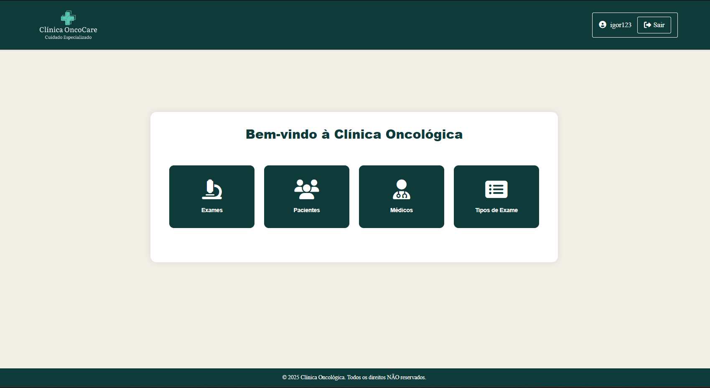
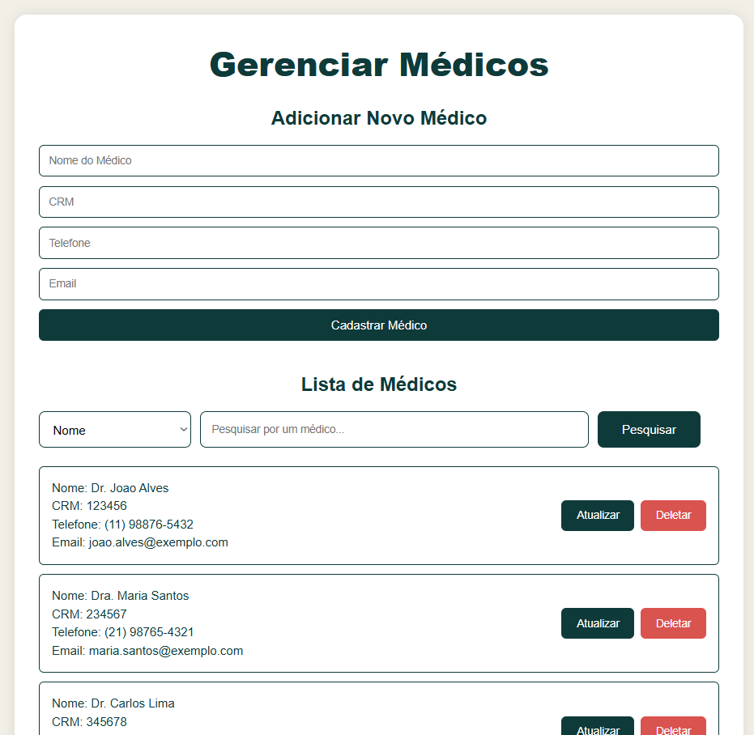
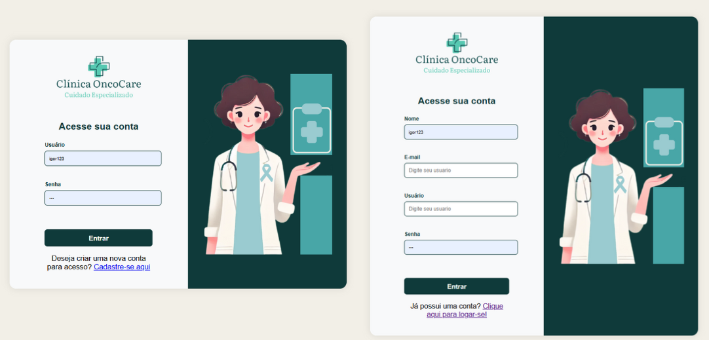

# Sistema Oncológico - Clínica OncoCare

## 📋 Descrição
O Sistema Oncológico é uma aplicação web desenvolvida para gerenciamento de exames, pacientes e médicos de uma clínica oncológica. Este projeto foi desenvolvido com foco no aprendizado e prática de conceitos fundamentais de desenvolvimento full stack, banco de dados relacionais e arquitetura cliente-servidor.

## 🚀 Tecnologias Utilizadas
- **Backend:**
  - Node.js
  - Express.js
  - Sequelize (ORM)
  - MySQL
  - JWT (JSON Web Tokens) para autenticação
  - bcryptjs para criptografia

- **Frontend:**
  - HTML
  - CSS
  - JavaScript (Vanilla)
  - EJS (Template Engine)

## 🎯 Objetivos do Projeto
- Compreensão da arquitetura cliente-servidor
- Implementação de endpoints RESTful
- Gerenciamento de requisições HTTP com fetch API
- Prevenção de SQL Injection através do uso de ORM (Sequelize)
- Implementação de sistema de autenticação com JWT
- Gerenciamento de banco de dados com migrations
- Prática de roteamento e organização de código

## 📦 Estrutura do Projeto
```
├── config/         # Configurações do banco de dados
├── controllers/    # Controladores da aplicação
├── middlewares/    # Middlewares (autenticação, etc)
├── migrations/     # Migrations do banco de dados
├── models/         # Modelos do Sequelize
├── public/         # Arquivos estáticos
│   └── images/     # Imagens do projeto
├── routes/         # Rotas da aplicação
├── views/          # Templates EJS
└── app.js          # Arquivo principal da aplicação
```

## 🖼️ Screenshots

### Página Inicial


### Gerenciamento de Médicos


### Tipos de Exames


### Login e Cadastro


## 🔧 Instalação e Execução

1. Clone o repositório
```bash
git clone [URL_DO_REPOSITÓRIO]
```

2. Instale as dependências
```bash
npm install
```

3. Configure as variáveis de ambiente
- Crie um arquivo `.env` na raiz do projeto
- Configure as variáveis necessárias (banco de dados, JWT secret, etc)

4. Execute as migrations
```bash
npx sequelize-cli db:migrate
```

5. Inicie o servidor
```bash
npm start
```

## 🔐 Funcionalidades Principais
- Sistema de autenticação com JWT
- Gerenciamento de pacientes
- Gerenciamento de médicos
- Controle de exames
- Interface responsiva
- Proteção contra SQL Injection
- Validação de dados

## 📚 Aprendizados
Este projeto foi desenvolvido como um exercício prático para consolidar conhecimentos em:
- Arquitetura cliente-servidor
- Desenvolvimento de APIs RESTful
- Manipulação de banco de dados relacionais
- Segurança na web
- Autenticação e autorização
- Frontend com JavaScript vanilla
- Organização e estruturação de código

## 👨‍💻 Autor
Igor Albuquerque
